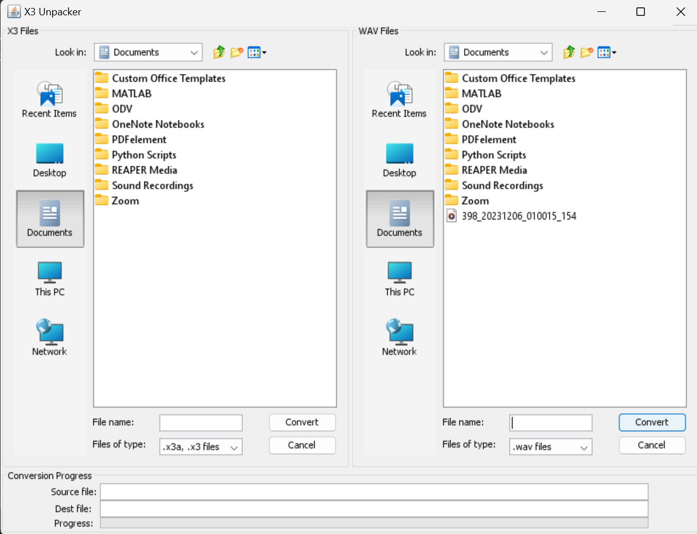

1. Download the .zip file from [this link](https://smrumarine.box.com/s/kiimwqqu5ayhl00tvxyzi34y8nnpjist).
2. Decompress the .zip file on your laptop, navigate into the folder “X3 Converter”, and double-click the “launch.bat” file. This should open the following window:

3. In the left panel, identify and select the files you want to decompress. Then, in the right panel, specify the destination folder where the decompressed files will be placed.
4. After selecting the compressed files in the left panel, click the 'Convert' button. This action will decompress the files and transfer them to the designated location in the right panel.