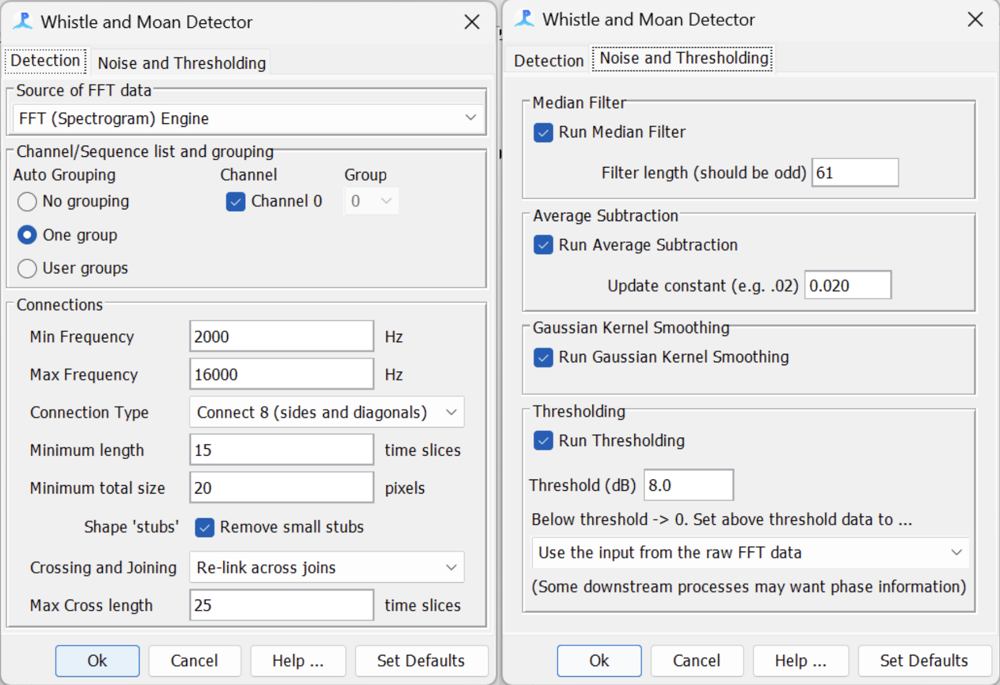

# Part 3: Building and Running the PAMGuard Detector

### Objective
To configure and operate the PAMGuard software for detecting killer whale calls using acoustic data from WAV files.

### Description
This section guides you through the step-by-step process of setting up PAMGuard with various modules tailored to analyze and detect specific acoustic signals in killer whale research. The setup includes modules for sound acquisition, data downsampling, and frequency transformation, as well as setting up a detector and output management system using MySQL.

## Steps
**1. Initial Setup:**
- Ensure that PAMGuard and MySQL are properly installed on your system.
- Start a new project in PAMGuard and create a new .psfx settings file, naming it appropriately and saving it in a logical location.

**2. Configure Sound Acquisition:**
- Navigate to *File -> Add Modules -> Sound Processing -> Sound Acquisition.*
- In the settings for Sound Acquisition (*Settings -> Sound Acquisition*), select 'Audio file folder or multiple files' under the Data Source Type. 
Choose the folder containing your raw wave recordings, ideally selecting all WAV files for a predetermined period. I did 5 day periods for my project.
- Set the 'Peak to Peak voltage range' to 2V for proper calibration.
- The "Audio Data Aquisition" settings will look like:

**3. Add the Decimator Module:**
- Go to *File -> Add Modules -> Sound Processing -> Decimator* and configure the decimator settings (*Settings -> Decimator*).
- Ensure the input Data Source is "Raw input data from Sound Acquisition."
- Set the output sample rate to 48,000 Hz and the interpolation to Linear.
- The Decimator settings will look like:

**4. Integrate FFT Module:**
- Add the FFT module by navigating to *File -> Add Modules -> Sound Processing -> FFT (Spectrogram Engine).*
- Configure the FFT settings (*Settings -> FFT (Spectrogram Engine)*), ensuring the source is the raw data from sound acquisition, the FFT length is 2048, and the FFT Hop is 1024 with a Hann window.
- The "FFT Parameters" settings will look like:

**5. Set Up Whistle and Moan Detector:**
- Add the Whistle and Moan Detector module via *File -> Add Modules -> Detectors -> Whistle and Moan Detector.*
- In the settings (*Settings -> Whistle and Moan Detector*), configure the FFT data source to be the FFT (Spectrogram) Engine. 
- Auto grouping = One group, and channel 0 is selected.
- On the Detection tab, set the Min/Max Frequency to 2000 Hz and 16,000 Hz to avoid false positives from low-frequency flow noise and any uneccesary upper frequency noise which could increase false positives.
- Connection type = Connect 8 (sides and diagonals), minimum length = 15 time slices, minimum total size = 20 pixels, crossing and joining = re-link across the join and max cross length = 25.
- Click the "Noise and Thresholding" tab and select all the tick boxes leaving the other settings at default. 
- The two tabs should look like this:

**6. Create a Spectrogram Display:**
- Add a spectrogram display via *File -> Add Modules -> Displays -> User Displays.*
- Click *User Display -> New Spectrogram Display.*
- Change the Number of Panels to 1 and hit Enter.
- It will look like this:

- Configure the display to show one panel and enable overlays of detected contours by right-clicking the spectrogram and adjusting the contours setting.
- Make sure that "enable" is selected and max frequency is set to 30000 so the contours appear on the spectrogram.
- The "Contour" settings will look like this:

**7. Database and Binary Storage Setup:**
- Add a database module (*File -> Add Modules -> Utilities -> Database*) and set up a new MySQL database for each 5-day data batch.
- Add binary storage (*File -> Add Modules -> Utilities -> Binary Storage*) and specify a folder for binary files.
- Ensure that the storage options are correctly set to include contours in both the binary storage and the database.
- The "Database Selection" will look like this:

**8. Run the Detector:**
- View the data model via *File -> Show Data Model* to ensure all connections are correct.
- The model will look like this:

- Start the detection process by clicking the red play button at the top of the PAMGuard window. 
- After each session, verify the data in MySQL.
- To process a new batch, update the input data source and database accordingly before running the detector again.

[← Previous: File Organizing](2-FileOrganizing.md) | [Next: Preparing the Results for Raven Pro →](4-PreparingResultsForRavenPro.md)