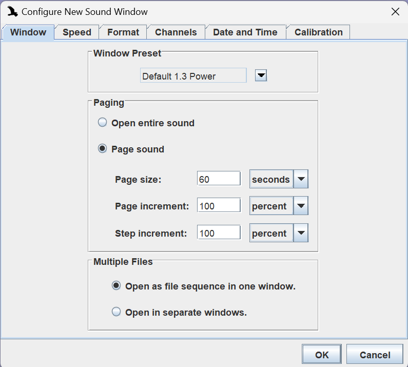
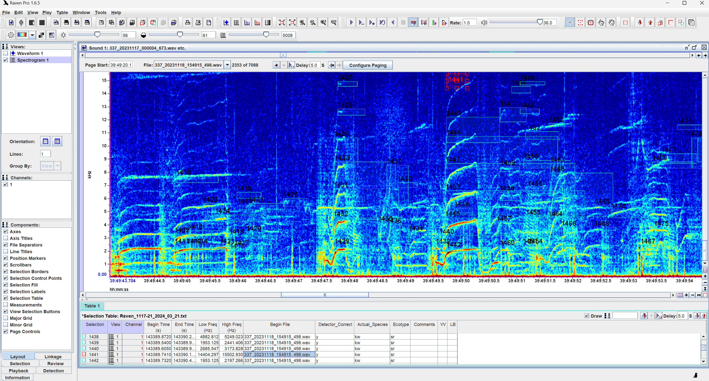

# Part 5: Raven Pro Analysis

### Objective
To analyze acoustic detections using Raven Pro and prepare the data for further statistical analysis.

### Description
This section guides you through the process of importing and analyzing sound files and detection data in Raven Pro. It includes steps for visual and auditory checks of detections, annotating data for further analysis, and preparing the final data for export to Excel.

### Steps
**1. Open Sound Files in Raven Pro:**
- Launch Raven Pro.
- Navigate to *File -> Open Sound Files.*
- Select the WAV sound files for the designated 5-day period or your specific batch.
- Click 'Open', then set the page sound settings:
  - Page size to 60s (since each WAV file is 60s),
  - Page increment to 100 percent,
  - Step increment to 100 percent.
- Confirm by clicking 'OK'.
- It will look like this:

**2. Import the Detection Table:**
- Go to *File -> Open Selection Table* to import the TXT file containing detection data.
- This will load the detection table into Raven.

**3. Configure Selection Table:**
- Right-click on the selection table and select *Select Measurements.*
- Move Begin File from *Available Measurements* to *Displayed Measurements* and press 'OK'.
- Right-click again on the selection table and select *Add Annotation Column* to customize the table according to your project’s needs.

**4. Annotate and Review Detections:**
- Add columns as necessary for your analysis, such as validation of detector accuracy, species, ecotype, and comments.
- Clicking on a detection in the table will navigate to the corresponding WAV file for visual and auditory verification.
- Your table may look something like this:

**5. Finalize and Export Data:**
- After reviewing and annotating all necessary detections, save the detection table in an appropriate location.
- Also save your workspace to be easily accesable if you need to reopen.
- The table will be saved as a text file, which is not ideal for statistical analysis.

**6. Convert the Text File to CSV for Analysis:**
- Open the [TXTtoCSV](../TXTtoCSV.py) script in Python.
- Set the input file and output location.
- Run the script to convert the text file to a CSV format, making it suitable for analysis in Excel.

---

[← Previous: Preparing Results for Raven Pro](4-PreparingResultsForRavenPro.md) | [Next: Statistical Analysis →](6-StatisticalAnalysis.md) 